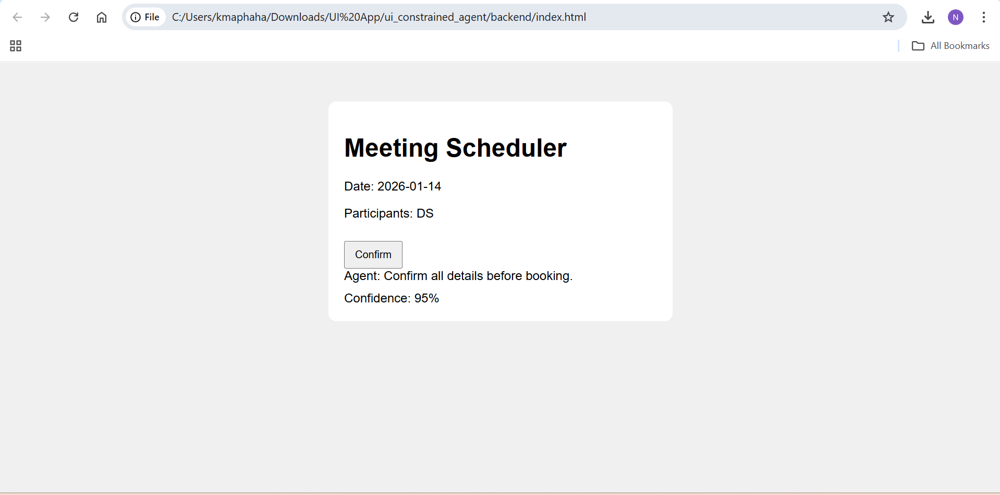
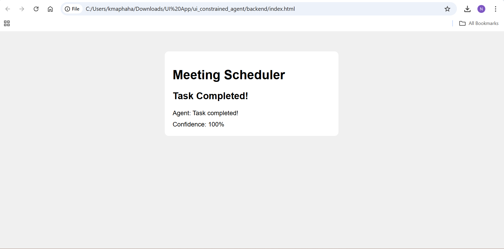

A. Setup Instructions
1. Clone repo or unzip project folder.
2. Navigate to backend:
   cd C:/Users/kmaphaha/Downloads/UI App/ui_constrained_agent/backend
3. Create virtual environment and activate:
   Windows: python -m venv venv
4. Install dependencies:
   pip install -r requirements.txt
5. Run backend:
   python app.py
6. Open frontend:
   open frontend/index.html in a browser
   OR
   python -m http.server 8000 from frontend folder
7. Interact with the agent via the UI.

B. UI vs Agent vs Memory State Model

UI: Displays steps, prompts, buttons, confidence, and errors.

Agent: Decides next step, validates input, sends messages ≤120 chars.

Memory State: Tracks current step, previous inputs, error messages, and confidence.

C. Failure Scenario

User selects a past date → agent rejects input → highlights error → user corrects date → task resumes from same step.

D. Why Plain Text Chat Fails

No character limit enforcement

No structured inputs → ambiguous recovery

No confidence/uncertainty visualization

Hard to enforce partial task completion

4. Screenshots / Diagrams

Screenshots:

Normal task completion

Failure + recovery (e.g., invalid date)

Confidence indicator

Interaction Diagram:

Start → select_date → select_participants → confirm → completed

Include arrows for error recovery and corrections
